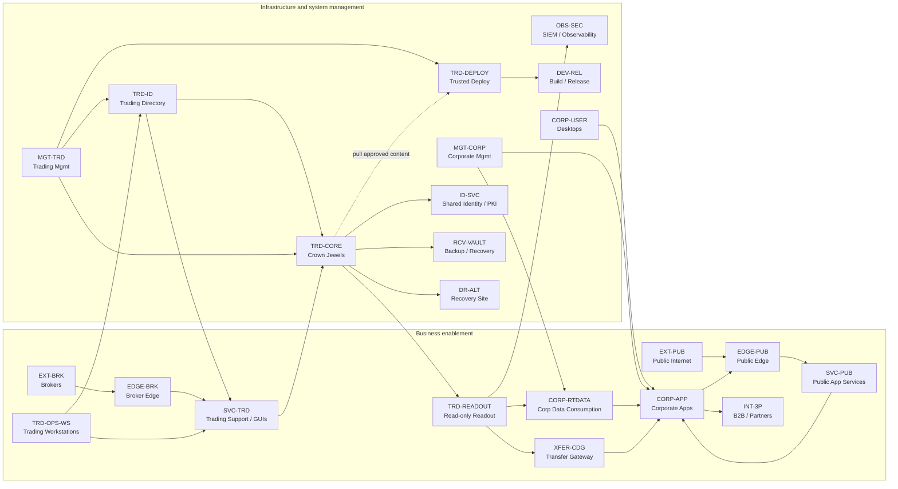
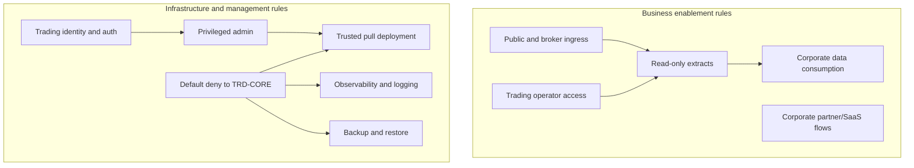
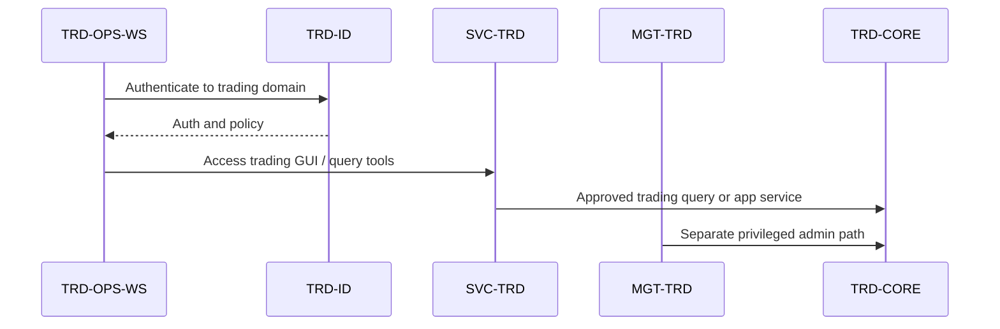
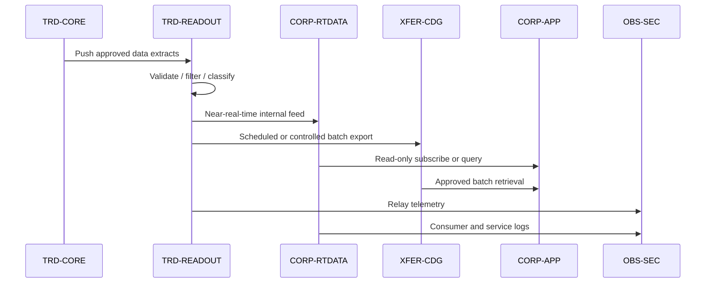

# Mermaid Diagrams: Controlled Push/Pull Crown Jewel Model with Policy-Style Rule Grouping

## High-level zone connectivity by cluster

## Policy rule group overview

## Trading operations workstation access

## Internal extract patterns

