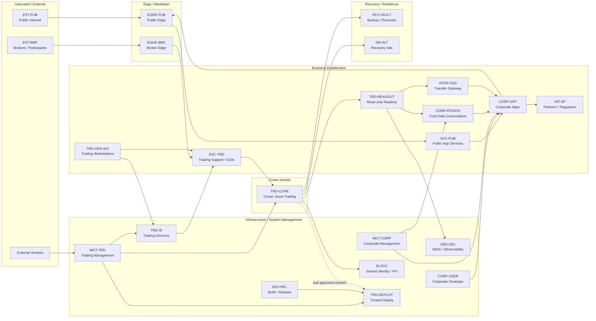
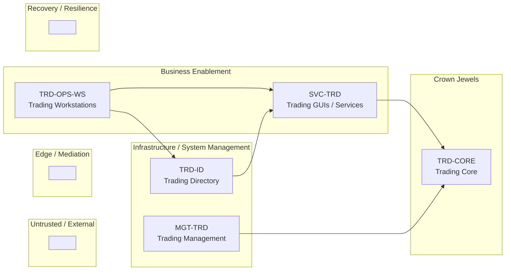
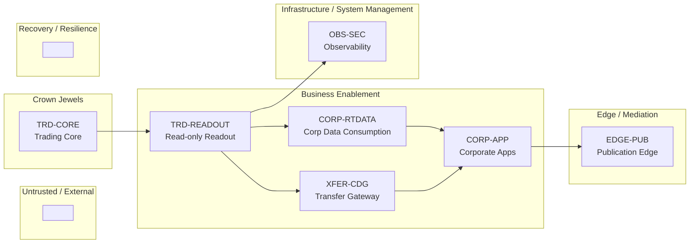
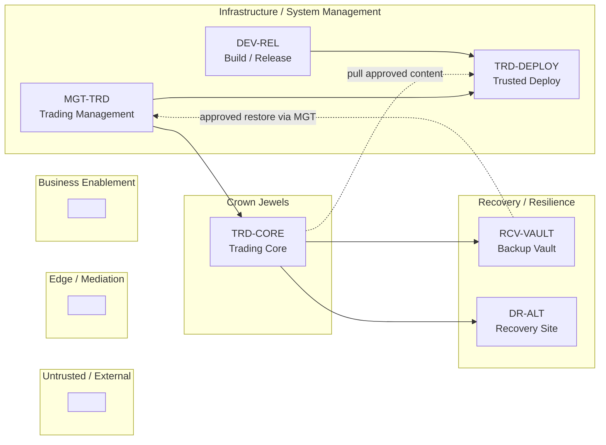

# Mermaid Diagrams: Vertical Swim Lanes Left to Right by Trust

## High-level zone architecture in swim lanes

## Trading operations access on same swim lanes

## Internal extract patterns on same swim lanes

## Trusted deployment and recovery on same swim lanes

